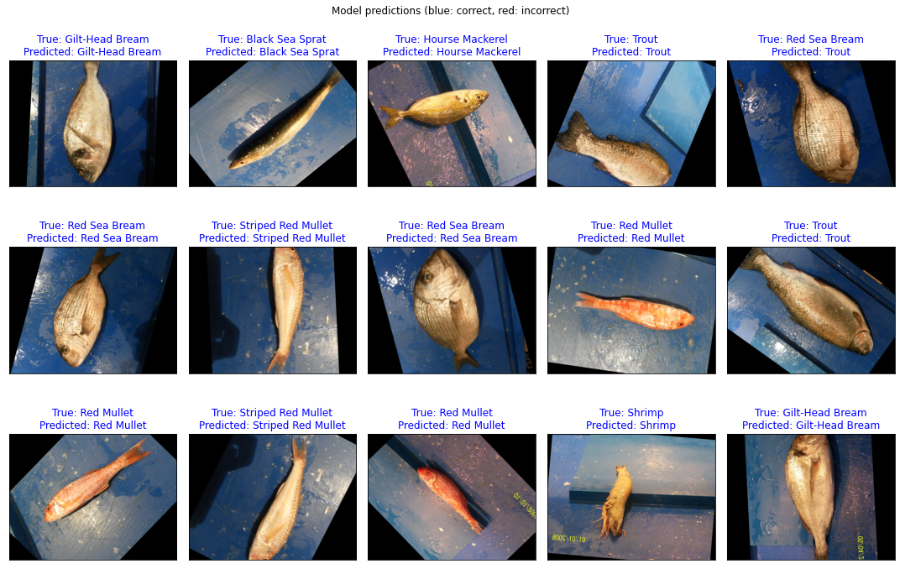
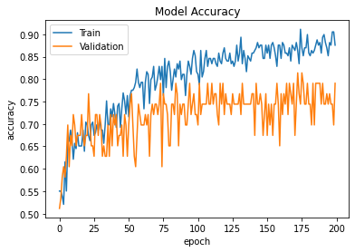
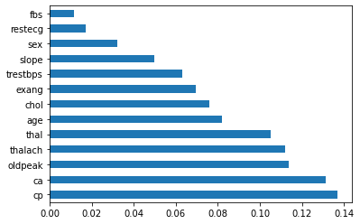
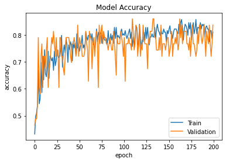

# Rukaya-lab.github.io
Portfolio

# Welcome to my GitHub Page

Here you can find some of the projects I have worked on. You can also check my [LinkedIn](https://www.linkedin.com/in/rukayat-amzat-889839173/) profile for further information.

## Machine Learning Projects

## Natural Language Processing

### [Detecting Hate Speech in Tweets](https://github.com/Rukaya-lab/NLP-notebooks/blob/main/Detecting%20Hate%20speech%20in%20tweet.ipynb)

- Project: Classification of Tweets into Hateful speech or Normal Speech
- Context: Hate speech is defined as public speech that expresses hate, disparages, or incites or encourages violence against another individual or group based on some characteristic such as race, gender, religious belief, sexual orientation, etc. 
- Dataset: The dataset contains 5,232 total rows of archived tweets with 3000 as non-hateful speech and 2242 hateful speech.
- Steps I took for the task
  - Removing stop words and special characters
  - Vectorization

- Result
  - Classification using the Guassian Naives Bayes Model with an Accuaracy of 60% and,

  - Classification after feature engineering with Count Vectorizer with Multinomial Naive Bayes gave an accuracy 86%.
  
 

## Deep Learning- Tensorflow

### [Segmentation and Classification of fishes using Images]()
- Project: Augmentation and Classification of the fishes based on images to their correct class using Sequential model.
- The dataset contains 9 different seafood types collected from a supermarket in Izmir, Turkey for a university-industry collaboration project at Izmir University of Economics.   
    The dataset contains 9000 images. For each class, there are 1000 augmented images and their pair-wise augmented ground truths.
- Approach:
  - Keras Image Data generation was used for Image preprocessing and all images are resized to a target size of (224, 224).
  - A convolution layer with filter size of 32 and a Max pool layer with a pool_size of (2, 2) was included in the sequential model.
  - Drop out of 30% was included to avoid overfitting.
  - The trained model achieved an accuracy of 92% and a recall of 98%

The model performed quite well with predicting the fish classes

### [Heart Disease Prediction](https://github.com/Rukaya-lab/Tensorflow-practice/blob/main/Dp_Classification%2C_heart_disease.ipynb)
- Project: Prediction whether a patient has heart disease based on their medical vitals.
- Dataset: The dataset contains the age, sex, blood pressure, heart rate, blood sugar etc values. It has 14 columns and about 300 data samples
- Approach: For this project, I decided to explore feature selection and behaviour of the model when couple of the features are left out.
  - Trained first a base sequential model that achieved a training loss of 0.37 and accuracy of 82% and validation loss of  0.54 and accuracy of 79%
    
  - Use the Recursive Feature Elimination approach with random forest model as the base model to slecet the top features that affect the models performance
    
  - Trained another sequential model that achieved a training loss of 0.48 and accuracy of 78% and validation loss of 0.45 and accuracy of 84%
    
- Findings: Even though the accuracy of the train set didn't experience any significant positive change, it is worthy noting that with a few of the features the model was still   able to learn enough of the operations of the dataset and perform fairly while and the loss difference is set to low. On the flip side the validation dataset perfromed better when the features were selected which can then translate to the fact that any unseen dataset tested with the second model is going to be close to its ground truth.

## Classification

### [Credit Card Lead Prediction](https://github.com/Rukaya-lab/Project-/blob/main/Credit_card_interest_classification.ipynb)

- Project: Happy Customer Bank is a mid-sized private bank that deals in all kinds of banking products, like Savings accounts, Current accounts, investment products, credit products, among other offerings.
- Task: Identifying customers that could show higher intent towards a recommended credit card
- Dataset description: 
  - The training dataset contains 245725 rows, 11 feature columns
  - The dataset is an unbalanced dataset,  the traget column contains 187437 Customer is not interested and 58288 Customer is interested.
  
 

 - Approach
   - Label Encoder for ordinal categorical columns and one hot encoder for nominal variables.
   - The dataset is an unbalanced dataset, the traget column contains 187437 Customer is not interested and 58288 Customer is interested.
      Hence, I used the SMOTE from imblearn.over_sampling library to upsample the class
   - Preprocessed the datset over a standard scaler to bring the distribution closer
   - Built the ML model using voting classifier which uses logistic regression and random forest as the two base sub model.
      The voting classifier gave an accuracy of 0.77, the logistic model gave an accuracy of 0.75 and the random forest model with an accuracy of 0.76
   - Built a Xgboost Model that gave 0.76 accuaracy and F1 score of 0.84
   - Built a basic tensorflow Sequential model and avoided overfitting by calling early stopping.
     The model gave and accuracy of: 0.8580 - mean squared error(mse) of : 0.0968 - and validation accuracy of : 0.7826 - validation_mse: 0.1465
     
   

## Data Analaysis and Exploration Projects

### [Investigate a Dataset: No Show Appointment](https://github.com/Rukaya-lab/Project-/blob/main/Investigate_a_Dataset.ipynb)

- Project: Medical Appointment No Shows. Why do 30% of patients miss their scheduled appointments?
- Context: A person makes a doctor appointment, receives all the instructions and no-show. Who to blame?
- Dataset: This dataset collects information from 100k medical appointments in Brazil and is focused on the question of whether or not patients show up for their appointment. A number of characteristics about the patient are included in each row.
- Exploration:
  - People who do not have Diabetes have a average show up rate of 80% while people with Diabetes have a average show up rate of 82%.
  - There are significant number of female records as compared to the male records.
  - In teenagers, less than 70% of those with hypertension tend to show up, which is less than average of all across the ages.
  - Possible Limitations could include the geography of the hospitals and residences of the patients and how there could be possible commuting problems that could affect show up rate.

### [Wrangle and Analyze Data: We Rate Dogs](https://github.com/Rukaya-lab/Project-/blob/main/WeRateDogs/wrangle_act.ipynb)

- Project: Wrangle data from different sources and Analyze.
  WeRateDogs is a Twitter account that posts and rates pictures of dogs. 
- Dataset:
Gathring the dataset from different data sources including:
  - A csv data file directly from archived data 
  - Using the Requests library to download the tweet image prediction
  - Using the Tweepy library to query additional data via the Twitter API
- Task:
  - detecting and cleaning quality issues and tidiness issue with the data.
    - There are significant number of missing values in the twitter archive dataset
    - The name column has a lot of duplicated values and some names are None
    - Tweet ids are currently in integer but they should be strings
    - The timestamp is in integer format rather than datetime
    - The dog stages are in separate columns but they should be in one
    - The three dataset have tweet id in common, hence could be combined
 - Exploration:
    - The most common dog breed is the Labrador Retriever.
    - The highest number of retweet is recorded in 2016
    - The most common name is Charlie followed by Cooper, Lucy and Oliver with the same count

 
 
